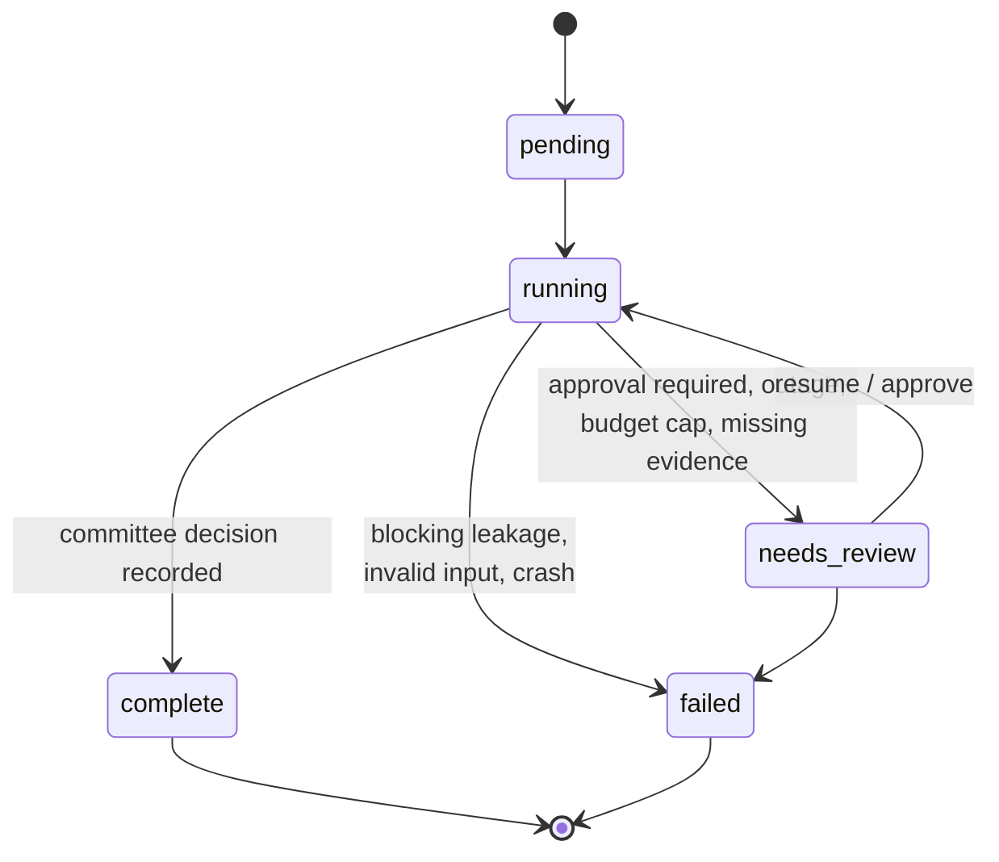
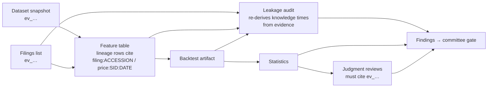
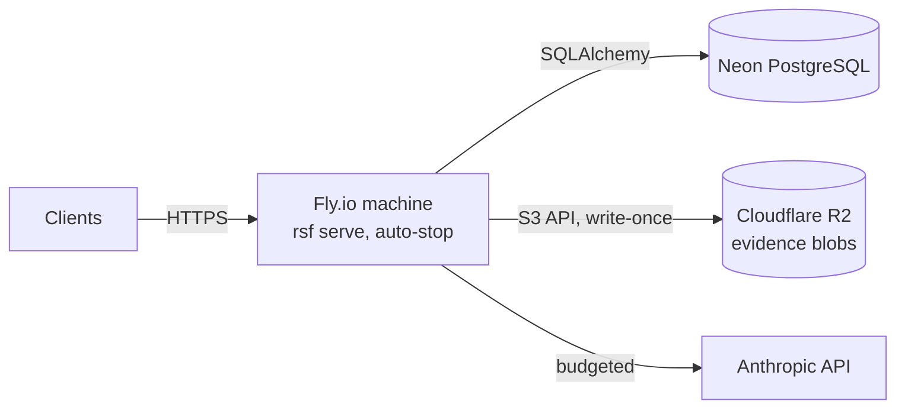

# Architecture

Systematic Research Factory runs one workflow: take a frozen trading hypothesis, test it on point-in-time data, audit it for leakage and overfitting, and put it in front of a human research committee. The design goal is that **every number is reproducible and every claim is traceable to stored evidence**. A language model helps only at three judgment steps, and it can neither compute results nor make decisions.

## Layers

| Layer | Owns | Never does |
|---|---|---|
| Deterministic core | Data access as of a date, features, backtests, leakage checks, statistics | Anything non-reproducible |
| MCP boundary | Typed inputs and outputs, authentication, the policy table, typed errors, auditing each call | Business logic |
| Workflow | Step order, persistence, retries, timeouts, resume, approvals | Arithmetic |
| Judgment | Reading structured artifacts and writing cited, schema-checked reviews | Computing numbers, approving anything |
| Storage | Durable state (database) and immutable evidence (blobs) | Updating or deleting audit, evidence, ledger or approval rows |

## The workflow

| # | Step | Kind | Artifact | Controlled failure |
|---|---|---|---|---|
| 1 | Hypothesis freeze | deterministic | frozen hypothesis + trial number | modified document under a frozen ID → `HYPOTHESIS_FROZEN` |
| 2 | Data acquisition | deterministic | dataset snapshot as of `as_of` (evidence) + data-quality report | outage → retry, then pause; bad data → `NEEDS_EVIDENCE` |
| 3 | Feature build | deterministic | feature table with knowledge-time lineage | no values → `NEEDS_EVIDENCE` |
| 4 | Backtest | deterministic | daily returns, positions, turnover, ICs | no returns → `NEEDS_EVIDENCE` |
| 5 | Leakage audit | deterministic | four checks, re-derived from evidence | any blocking check → run **fails** |
| 6 | Statistical review | deterministic | Sharpe, Newey-West t, bootstrap CI, deflated Sharpe, delay sensitivity | failed threshold → gate rejects |
| 7 | Economic rationale review | judgment | cited review | invalid or uncited output → `NEEDS_EVIDENCE` |
| 8 | Implementation review | judgment | cited review | same |
| 9 | Research committee | gate + judgment + **human** | memo, then decision | pauses until an approver decides |

A run moves only along these transitions; any other transition is rejected (`RUN_TRANSITIONS` in `domain/project_models.py`). Each step's result is persisted before the next step starts. On resume, completed steps are reused, never re-executed: the idempotency key is a hash of the experiment, the step and the prior steps' artifact IDs.

## Evidence and provenance

Everything a step reads or produces is **evidence**: bytes stored once in a content-addressed blob store (SHA-256), plus a database record with a source URI, a type, the `as_of` time and metadata. An evidence ID is a hash of the content, source and `as_of`, so the same experiment always produces the same IDs. Findings link to evidence IDs, and judgment output is rejected if it cites an ID the run doesn't have.

The leakage audit **trusts evidence, not the feature builder**. For every lineage input it looks up the true knowledge time (the filing's SEC acceptance time, or the session close) from the stored evidence, and compares that to the decision time. A builder that misreports times is caught too; there's a test for exactly that.

## Point-in-time rules

- Filings are known at SEC `acceptanceDateTime`, which is UTC. This was checked against 3,005 filings (see `data/edgar.py`).
- A session's price is known at its 16:00 America/New_York close. Filings accepted after the close are tradable only at the next close.
- The universe is resolved as of each decision date, including companies that later delisted. Future delistings and tickers are hidden from queries made before them.
- `as_of` is required on every data query and must be timezone-aware.

## Datasets

| Name | Filings | Prices | Purpose |
|---|---|---|---|
| `synthetic:v1` | synthetic, with planted restatements, IPOs, delistings, ticker reuse, after-close filings | simulated, planted signal of known strength | tests and the demo |
| `synthetic:v1:null` | same | no signal | null-hypothesis tests |
| `synthetic:v1:weak` | same | weak signal | overfitting tests |
| `edgar-semi:v1` | **real SEC EDGAR**, 44 companies, 2019–2023, including 12 exits and 7 IPOs | simulated from the real acceptance times | real-world timing quirks with a known right answer (ADR-0003) |

Prices always carry a "simulated" label. The planted signal reacts only at acceptance time, so a period-end leak inflates results by a known amount. The tests and the evaluation suite rely on that.

## Judgment steps and the model

A judgment step builds a structured payload: the frozen hypothesis, with researcher text wrapped in `<untrusted_data>`, the statistics, and a catalog of the run's evidence IDs. It sends that payload to a provider:

- `rules`: a deterministic reviewer. It is the offline default, needs no API key, and is the reference in evaluations.
- `anthropic`: Claude (`claude-opus-5` by default) with JSON-schema structured output and server-side refusal fallback. The procedure from the relevant Agent Skill is loaded into the system prompt.

The output is validated before it is kept. Invalid or uncited output gets one retry with feedback; after that the step pauses with `NEEDS_EVIDENCE`. Every model call is checked against per-run and per-day budgets before it is made, and each call records its model, token counts, cost, prompt hash, Skill hash and schema version.

The **committee gate** is deterministic (`services/approvals.py`). The model drafts a memo but cannot change the recommendation. The approver must hold the approver role, must not be the requester, and may record `approve` only when the gate recommends it.

## Reproducibility

- Every identifier that matters is content-derived. The only random IDs are run IDs and approval IDs.
- The dataset snapshot a run used is stored as evidence, and `rsf replay <run_id>` re-executes the deterministic steps from that snapshot and compares artifact hashes. Tests prove the replay is byte-identical, including after live data changes.
- The deflated Sharpe ratio uses the trial count and earlier trial results **as of the experiment's freeze**, so later experiments never change an earlier review.
- `evals/demo_manifest.json` records the expected outcome of each demo scenario. Artifact hashes are exact within a platform. Across CPU architectures the last floating-point bit can differ, so the cross-platform test compares outcomes.

## Deployment

See [deployment.md](deployment.md) and [runbook.md](runbook.md). Decisions are recorded in [adr/](adr/README.md).
