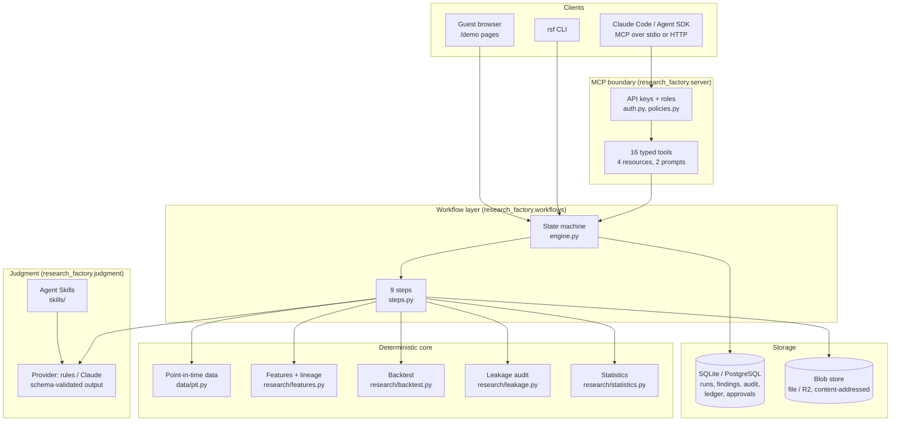
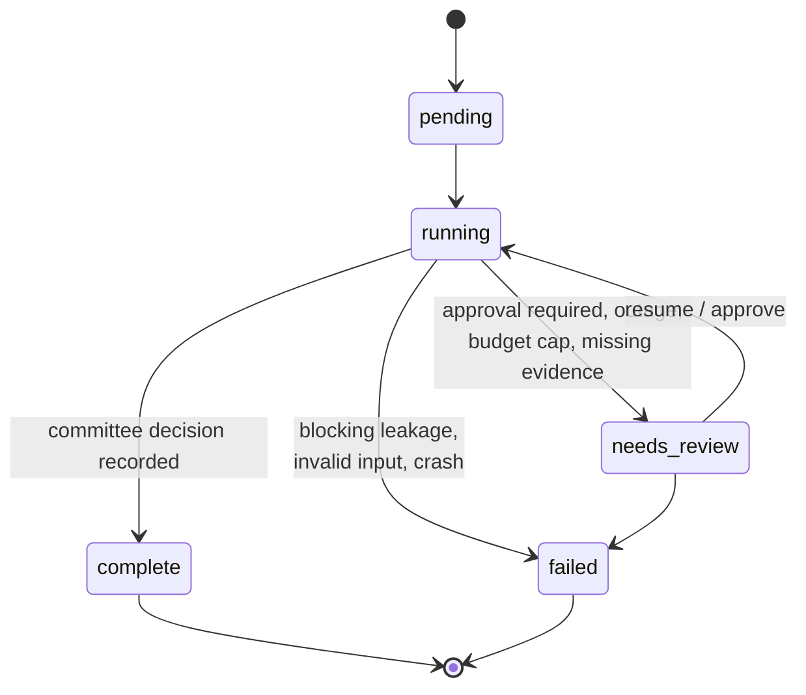
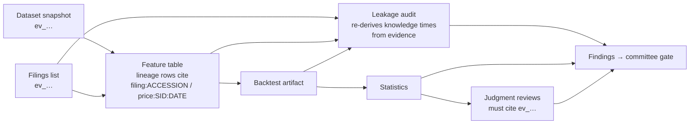
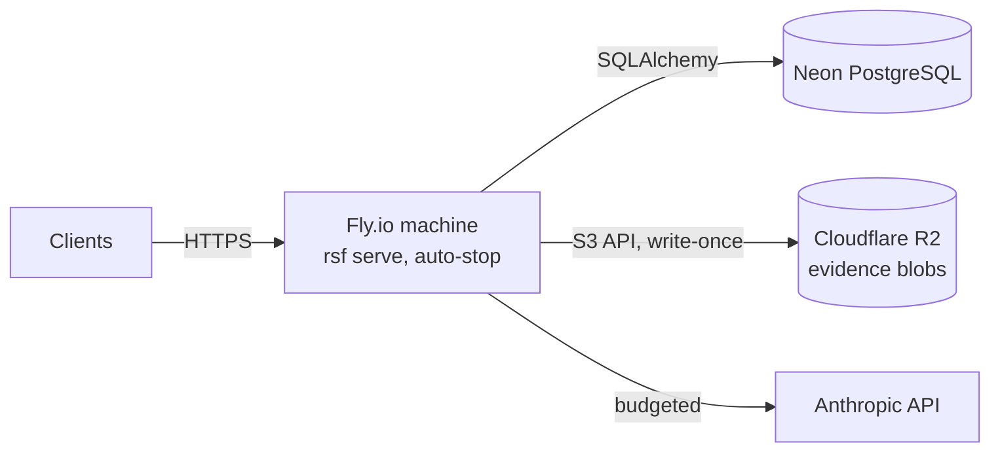

# Architecture

Systematic Research Factory runs one workflow: take a frozen trading hypothesis, test it on point-in-time data, audit it for leakage and overfitting, and put it in front of a human research committee. The design goal is that **every number is reproducible and every claim is traceable to stored evidence**. A language model drafts three scoped reviews. Numeric claims are resolved from artifact fields and rendered by code; qualitative interpretation still needs review. A separate targeted evaluation exercises the point-in-time skill. Models cannot approve runs.

## Layers

| Layer | Owns | Never does |
|---|---|---|
| Deterministic core | Data access as of a date, features, backtests, leakage checks, statistics | Anything non-reproducible |
| MCP boundary | Typed inputs and outputs, authentication, the policy table, typed errors, auditing each call | Business logic |
| Workflow | Step order, persistence, retries, timeouts, resume, approvals | Arithmetic |
| Judgment | Reading structured artifacts and writing cited, schema-checked reviews | Computing numbers, approving anything |
| Storage | Durable state (database) and immutable evidence (blobs) | Updating or deleting audit, evidence, ledger or approval rows |

## The workflow

| # | Step | Kind | Artifact | Controlled failure |
|---|---|---|---|---|
| 1 | Hypothesis freeze | deterministic | frozen hypothesis + trial number | modified document under a frozen ID → `HYPOTHESIS_FROZEN` |
| 2 | Data acquisition | deterministic | dataset snapshot as of `as_of` (evidence) + data-quality report | outage → retry, then pause; bad data → `NEEDS_EVIDENCE` |
| 3 | Feature build | deterministic | feature table with knowledge-time lineage | no values → `NEEDS_EVIDENCE` |
| 4 | Backtest | deterministic | daily returns, positions, turnover, ICs | no returns → `NEEDS_EVIDENCE` |
| 5 | Leakage audit | deterministic | seven checks: lineage completeness, semantic source binding, finite value recomputation, knowledge time, execution delay, universe, target | any blocking check → run **fails** |
| 6 | Statistical review | deterministic | Sharpe, Newey-West t, bootstrap CI, deflated Sharpe, delay sensitivity | failed threshold → gate rejects |
| 7 | Economic rationale review | judgment | cited review | invalid or uncited output → `NEEDS_EVIDENCE` |
| 8 | Implementation review | judgment | cited review | same |
| 9 | Research committee | gate + judgment + **human** | review-time trial check, memo, then decision | pauses until an approver decides |

A run moves only along these transitions; any other transition is rejected (`RUN_TRANSITIONS` in `domain/project_models.py`). Each checkpoint, its findings and audit event are written in a single owner-fenced transaction, including durable `fail_run`, `run_decision` and `gate_context` effects. Recovery reapplies terminal effects before advancing. On resume, completed steps are reused, never re-executed: the idempotency key is a hash of the experiment, the step and the prior steps' artifact IDs.

Robustness rules (tested in `tests/test_audit_regressions.py`):

- **One owner may publish.** `advance` claims a lease, heartbeats during long work and fences repository writes against the live owner. An expired worker cannot publish after takeover. Approval uniqueness binds the run, step and exact gate context; immutable stale decisions remain historical while a fresh context can receive a new decision.
- **Retries supersede.** When a step that paused or failed runs again, its earlier findings are marked superseded. The gate reads only the findings behind each step's current result, so a run that recovered can still be approved.
- **Nothing gets stuck.** Database and storage outages are retryable and pause the run (`UPSTREAM_UNAVAILABLE`). Any other unexpected error pauses it (`INTERNAL`) instead of leaving it `running`.
- **Timeouts stop waiting, not external work.** Abandoned threads cannot publish workflow evidence after their lease is lost. Paid-call settlement runs inside the worker and survives a timed-out waiter. An uncertain transport outcome retains its reservation and blocks a second dispatch for that step until audited reconciliation confirms the first call has finished.
- **Resume keeps a run's shape.** An analysis run resumes as an analysis run. Paused runs can be cancelled by their requester or an approver.

## Evidence and provenance

Everything a step reads or produces is **evidence**: bytes stored once in a content-addressed blob store (SHA-256), plus a database record with a source URI, a type, the `as_of` time and metadata. An evidence ID is a hash of the content, source and `as_of`, so the same experiment always produces the same IDs. Findings link to evidence IDs, and judgment output is rejected if it cites an ID the run doesn't have.

The leakage audit **trusts evidence, not the feature builder**. It requires exactly one lineage row for every feature value, and recomputes each value from the inputs that row cites (the cited filings' EPS, or prices between the cited sessions). A builder that reports honest-looking lineage for values it computed some other way fails. For every input it looks up the true knowledge time (the filing's SEC acceptance time, or the session close) from the stored evidence and compares it to the decision time, so a builder that misreports times is caught too.

## Point-in-time rules

- Filings are known at SEC `acceptanceDateTime`, which is UTC. This was checked against 3,005 filings (see `data/edgar.py`).
- A session's price is known at its 16:00 America/New_York close. Filings accepted after the close are tradable only at the next close.
- The universe is resolved as of each decision date, including companies that later delisted. Future delistings and tickers are hidden from queries made before them.
- `as_of` is required on every data query and must be timezone-aware.

## Datasets

| Name | Filings | Prices | Purpose |
|---|---|---|---|
| `synthetic:v1` | synthetic, with planted restatements, IPOs, delistings, ticker reuse, after-close filings | simulated, planted signal of known strength | tests and the demo |
| `synthetic:v1:null` | same | no signal | null-hypothesis tests |
| `synthetic:v1:weak` | same | weak signal | overfitting tests |
| `synthetic:v1:fast` | same | two-session drift | execution-delay fragility tests |
| `edgar-semi:v1` | **real SEC EDGAR**, 44 companies, 2019–2023, 1,325 filing/version records, including 10 exits and 8 IPOs; listing windows are filing-derived proxies; some EPS values (including Q4 using annual weighted shares) are derived; `restated`/`split_adjusted` tags are heuristic | simulated from the real acceptance times; exits are price-neutral | real-world timing quirks with a known right answer (ADR-0003) |

The curated universe is not a complete investable historical security master. The calendar uses weekdays rather than an exchange holiday calendar. Frozen date ranges must be fully covered under that calendar, including the final close at `as_of`. Execution checks listed status and price availability on the fill date: unfillable trades are recorded, with no hindsight reranking or phantom transaction costs. Constant holding weights, simplified costs and no final unwind remain modeling limits. Prices always carry a "simulated" label. The planted signal reacts only at acceptance time, so a period-end leak inflates results by a known amount. The tests and the evaluation suite rely on that. The generator's `expected_event_ic` is a per-filing (event) correlation. It is not comparable to the backtest's cross-sectional rebalance IC, which is lower because most rebalance-date signals are weeks old.

## Judgment steps and the model

A judgment step builds a structured payload: the frozen hypothesis, with researcher text wrapped in `<untrusted_data>`, the statistics, and a catalog of the run's evidence IDs. It sends that payload to a provider:

- `rules`: a deterministic reviewer. It is the offline default, needs no API key, and is the reference in evaluations.
- `anthropic`: Claude (`claude-opus-5` by default) with JSON-schema structured output, automatic paid retries/fallback disabled, and token-count preflight. Relevant Skill text and references are included with an explicit adapter scope. Full external skill procedures remain available separately; the automated review does not certify tests it cannot run.

The output is validated before it is kept. Numeric calculations use cited evidence IDs and canonical JSON field pointers; code resolves finite values and controls their labels/formatting. Digit-bearing numeric prose is rejected. Written-out quantities and other semantic claims still need review. Citation existence alone does not prove that qualitative prose is supported. `needs_evidence` pauses the step even if its verdict otherwise appears favorable. Invalid or uncited output gets one retry with feedback; after that the step pauses with `NEEDS_EVIDENCE`. A committee memo that recommends something more permissive than the gate is invalid. Skill procedures are injected with a note that the step has no tools, and they can be switched off (`rsf eval --no-skills`) to measure their effect. Paid dispatch transactionally reserves a conservative allowance against per-run tokens/cost and global daily cost before a call. Actual usage settles on success, refusal and late completion; ambiguous outcomes retain their allowance. Unknown model prices fail preflight. The operator can inspect `rsf usage --pending` and use audited `rsf reconcile-usage` only after confirming the call has finished. Prompt, schema, Skill/reference and input provenance accompany stored reviews.

The **committee gate** is deterministic (`services/approvals.py`). Before it runs, the committee step recomputes the deflated Sharpe at the number of related trials that exist *now*, and gates on that ([ADR-0008](adr/0008-review-time-trial-counting.md)). The model drafts a memo but cannot change the recommendation. Guest live runs use the deterministic rules reviewer, never a paid model ([ADR-0009](adr/0009-production-defaults.md)). The approver must hold the approver role, must not be the requester, and may record `approve` only when the freshly computed gate recommends it. Approval consumption rechecks the same context; later related trials or changed findings invalidate the earlier approval for completion.

## Reproducibility

- Evidence, experiments, findings and artifacts have content-derived identities. Finding identity includes severity, confidence, cited evidence, assumptions and metadata. Operational identifiers such as runs, approvals, worker owners and reservations may be random.
- `rsf replay <run_id>` executes only the first six deterministic stages from archived snapshots and threshold settings. It makes no model calls and does not create a new human approval. Snapshot pins are isolated per run. Exact replay requires the recorded source, dependencies, Python build, libc and numerical CPU/backend configuration; preserve the original release image and runtime identity. Containers alone do not fix host numerical dispatch. Legacy runs without that identity cannot claim exact replay, and mismatched runtimes fail explicitly.
- The stored statistical stage uses its recorded freeze-time trial inputs for reproducibility. The committee independently recomputes the decision gate using all related trials available at review time. Later experiments can therefore invalidate a pending approval without changing the archived statistical artifact.
- `evals/demo_manifest.json` records demo outcomes and platform-specific artifact hashes. Stored candidate archives contain original runs, snapshots, expected artifacts and runtime identity. Separate historical CI jobs select immutable old source and pinned Python 3.12/3.14 containers, verify archive integrity and classify a narrowly bounded, measured BLAS reduction difference without claiming byte identity. Current code rejects incompatible manifests; matching-runtime replay tests remain exact. See the [CI follow-up](audits/2026-09-27/ci-followup.md). Candidates are not earlier published releases.

## Deployment

See [deployment.md](deployment.md) and [runbook.md](runbook.md). Decisions are recorded in [adr/](adr/README.md).
