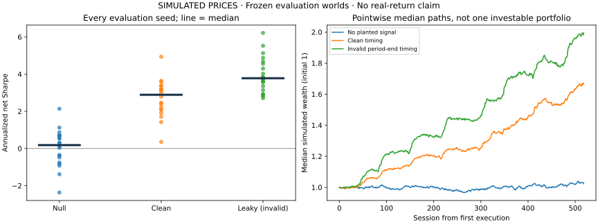
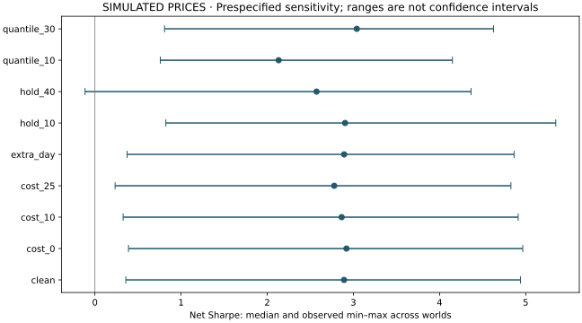

# When a better backtest is invalid

**Controlled simulation, 2026-09-27. All prices and returns are simulated.** A fiscal-period timing leak increased median paired Sharpe by 1.23 in the planted-signal worlds. The audit blocked every deliberately leaky case. Clean inputs still did not guarantee statistical approval: only 13 of 20 planted worlds passed the combined audit/statistical gate.

This study demonstrates research controls and their limits. It does not establish an investable earnings anomaly or measure live-model quality.

## Design and provenance

The [protocol](protocol.md) was committed as `602c27f` before executing the study. Two development seeds (101–102) used 2019–2021; twenty evaluation seeds (200–219) used 2022–2023, with older filings retained for warm-up. Each evaluation seed generated coupled no-planted-signal and planted-signal worlds. The existing generator, signal, thresholds and seed set were not tuned after observing results.

The harness ran 240 seed/control/configuration combinations: two configurations in each null world and ten in each planted world. All are in [study.json](results/study.json) and [metrics.csv](results/metrics.csv), including failures. Each record identifies the dataset hash, configuration, raw daily returns, audit and statistical checks. These are deterministic research calculations; no model reviews or human approvals were fabricated.

Initial execution used Windows, CPython 3.12.10, NumPy 2.5.3 and package source hash `be644e8895c310919ae4e6cffacc9d0ae52a886ffee8512cc50057774c4e3d0e` (preserved source commit `2300404`). The runner is preserved in `fd8ea50`; its normalized SHA-256 is `7cfe6d131be2b9a9b61648b3aa430dc8129777f1370e0bf0586ad6f1592c5331`. The JSON also records protocol and dependency identities. Later runtime-fingerprint improvements do not retroactively change this record. See the [CPU replay finding](../audits/2026-09-27/ci-followup.md).

## Signal and portfolio

Rank the latest available quarterly EPS year-over-year change, using the filing version known at the decision close. Long the top 20%, short the bottom 20%, with 0.5 gross exposure on each side. Rebalance every 20 weekday sessions; execute at the next close; charge five basis points per unit turnover. The intentionally invalid control uses period-end availability instead of acceptance time. This is EPS growth, not an analyst-consensus earnings surprise. The [data sheet](data-sheet.md) explains availability, universe and simulation limitations.

## Primary results

All figures below summarize twenty evaluation worlds per row. Returns and drawdowns are cross-world medians; the gate combines the leakage audit and deterministic statistical checks, not a committee investment decision.

| Control / timing | Median net Sharpe | Sharpe range | Median cumulative return | Median max drawdown | Audit blocks | Gate passes (Wilson 95%) |
|---|---:|---:|---:|---:|---:|---|
| No planted signal / clean | 0.18 | −2.37 to 2.14 | 2.35% | −12.00% | 0/20 | 0/20 (0–16.1%) |
| No planted signal / leaky | −0.13 | −1.25 to 2.32 | −2.80% | −13.26% | 20/20 | 0/20 (0–16.1%) |
| Planted signal / clean | 2.89 | 0.36 to 4.94 | 66.96% | −5.44% | 0/20 | 13/20 (43.3–81.9%) |
| Planted signal / leaky | 3.78 | 2.71 to 6.22 | 99.42% | −5.12% | 20/20 | 0/20 (0–16.1%) |



The median **paired** leak-minus-clean Sharpe difference is +1.23 (range +0.43 to +2.79) in planted worlds and −0.02 (−0.84 to +1.57) in null worlds. The difference of the two marginal medians is a different statistic. Timing leakage does not necessarily improve every strategy; its invalidity follows from unavailable information, not from whether the resulting return looks attractive.

Each leaky control was blocked in 20/20 worlds, a Wilson interval of 83.9–100% for that control's simulated detection frequency. This does not establish perfect detection against unknown attacks. Likewise, 0/20 clean null gate passes is compatible with a frequency as high as 16.1% under this interval. Removing planted jump/drift is a useful negative control, not proof that this generator is an exact statistical null for every strategy.

## Frozen sensitivity analysis

| Planted-world configuration | Median net Sharpe | Gate passes |
|---|---:|---:|
| Baseline: 5 bps, 20 sessions, 20% tails | 2.89 | 13/20 |
| Costs: 0 / 10 / 25 bps | 2.92 / 2.86 / 2.78 | 13 / 12 / 12 of 20 |
| One extra execution session | 2.89 | 12/20 |
| Hold/rebalance: 10 / 40 sessions | 2.90 / 2.57 | 13 / 12 of 20 |
| Tails: 10% / 30% | 2.13 / 3.04 | 7 / 15 of 20 |



These configurations were all specified in advance; none is selected as a winner. Higher costs lowered median Sharpe. An extra session barely changed median Sharpe and reduced median cumulative return from 66.96% to 65.22%; this result does not justify a claim that delay always destroys the signal. Wider tails improved median Sharpe while lowering median cumulative return, illustrating that these measures answer different questions.

The clean baseline's median mean turnover per rebalance was 0.4075, with median annualized arithmetic cost drag of 0.257 percentage points. Median average largest intended absolute name weight was 5.82%; maximum intended name weight was 6.25% in each world. Unfilled orders ranged from zero to four (median one). Intended weight concentration is not realized P&L attribution; no complete concentration stress test is claimed.

## Statistical interpretation

The calculation uses a Bartlett HAC variance estimate, with lag length at least the holding period, to address serial dependence in the mean-return statistic. This follows the covariance-estimation approach of [Newey and West](https://www.nber.org/papers/t0055); it does not eliminate finite-sample or model-specification risk. Circular block-bootstrap Sharpe intervals use 2,000 resamples and block size equal to the holding period. Cross-world min–max ranges shown in the sensitivity chart are **not confidence intervals**.

DSR uses a ten-configuration assumed trial count and the asymptotic variance floor. The [Deflated Sharpe Ratio paper](https://www.davidhbailey.com/dhbpapers/deflated-sharpe.pdf) motivates selection and non-normality adjustments; correlated strategies and dependent observations complicate its interpretation here. At assumed counts 1/10/100, median clean planted DSR is 1.0000/0.9950/0.9467; median clean null DSR is 0.6020/0.0976/0.0126. These sensitivity counts do not represent 100 actual optimizations. DSR alone is not the combined gate, and a reported DSR is not a calibrated probability that a strategy will earn money.

The known signal generator, twenty replications, weekday calendar, full-population event standardization, constant-weight accounting, omitted borrowing/liquidity/final-liquidation costs and selected universe limit external validity. No real-return, production-trading or general false-positive-control claim follows from this study.

## Reproduce

```bash
uv sync --locked
uv run --no-sync python scripts/research_study.py --out var/research-reproduction
```

Use a fresh output directory; the command refuses to overwrite an existing result bundle. Compare records, dataset hashes and summary values separately from runtime provenance. Exact bytes require the recorded numerical runtime; do not silently round or replace the original result files. The protocol records no design deviations.
